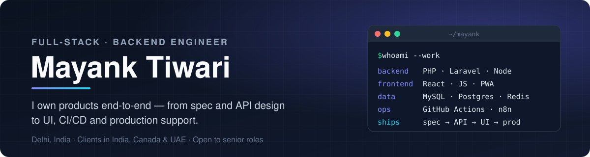

  

  
  
  

---

## 👋 About me

I'm a **Full-Stack Developer at SK Info Techies**, a Delhi-based digital agency, where I build and run production software for clients in **India, Canada and the UAE**.

Most of my projects I own **end-to-end** — requirements, database and API design, frontend, deployment and post-launch support. I've shipped across **FinTech, EdTech / School ERP, e-commerce with technical SEO, business automation and IoT**, and I build my own SaaS products alongside client work.

**Looking for:** a senior full-stack or backend role where I can own systems, not just tickets.

---

## 🧭 How I work

| Principle | In practice |
|---|---|
| 📝 **Spec before code** | I write PRDs, technical specs, role-based feature specs and phased roadmaps before building — so scope, data model and edge cases are agreed up front. |
| 🔌 **API-first backends** | Clean REST APIs with a consistent auth context and error format, documented and kept current in Postman collections for frontend and QA teams. |
| 🧩 **Own the full lifecycle** | One person from DB schema → API → UI → deployment → support. I'm comfortable being the engineer a client talks to directly. |
| ⚙️ **Automate the boring parts** | CI/CD with GitHub Actions (even onto shared hosting), n8n and scraper pipelines instead of manual data entry, bots for team notifications. |
| 📦 **Ship in phases** | MVP first, then iterate — every project runs on a phase plan with a tracker so progress is visible to everyone. |
| 🌍 **Remote-ready** | Day-to-day delivery with clients across three countries and time zones (IST, Canada, Gulf). |

---

## 🛠️ Tech stack

**Backend** &nbsp;

**Frontend** &nbsp;

**Data & infra** &nbsp;

**Automation & IoT** &nbsp;

---

## ⚡ Engineering highlights

My client work is under NDA, so here's the kind of problems I solve rather than the code itself.

- **Payments & KYC APIs** — Designed REST APIs for a mutual-fund platform: SIPs, payment gateways, KYC and portfolios, with separate partner (distributor) and customer auth modes.
- **Queue-based processing** — Node.js + BullMQ + Redis workers that scrape, enrich and score local businesses at scale without blocking the API.
- **Real-time two-way calendar sync** — Each admin's own Google Calendar kept in sync with a Laravel panel via push-notification webhooks, with no polling.
- **One-click deploys without a DevOps team** — GitHub Actions pipelines that ship to production, including shared hosting, so small clients get proper CI/CD.
- **Automation over data entry** — Scraper + n8n pipelines that ingest, clean and publish content automatically instead of by hand.
- **IoT inside business software** — Wearable-band and live-GPS transport tracking integrated into a multi-role school ERP.
- **Technical SEO at the code level** — Schema.org structured data, dynamic sitemaps, redirect maps and Google Merchant feeds for e-commerce sites in the UAE and Canada.
- **No-code → custom code** — Replaced a client's no-code CRM with a custom build, including a full data migration.

**Domains I've shipped in:** FinTech · EdTech / School ERP · E-commerce & SEO · Business automation · IoT

---

  <b>Let's talk</b> — <a href="mailto:mtiwari.connect@gmail.com">mtiwari.connect@gmail.com</a> · <a href="https://www.linkedin.com/in/mayanktiwari-dev">LinkedIn</a>

