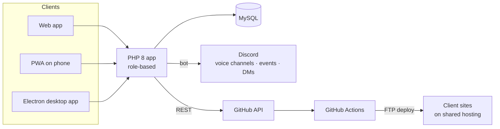

# 🏢 Agency Operations ERP

[← Back to profile](../README.md)

> Internal tool for a software agency · Code is private · **Role:** sole developer — spec, architecture, build and rollout

## The problem

A growing agency was running work across chats, spreadsheets and separate meeting tools. Developers deployed client sites by hand over FTP / hosting panels, which was slow and error-prone, and nobody had a single view of who was working on what.

## What I built

One internal ERP covering the whole day-to-day of the agency.

| Area | Features |
|---|---|
| **People** | Six roles — Admin, CEO, Manager, Team Leader, Developer, Intern; attendance and leave approvals |
| **Work** | Project allotment, daily tasks, schedule — presented as a **sticky-note board** so work is visual and quick to update |
| **Meetings** | **Discord integration** — a bot creates a voice channel and a scheduled event for each meeting; "Join" in the ERP opens Discord |
| **Notifications** | Sent to Discord as both channel posts and direct messages |
| **Deployments** | **GitHub Actions auto-deploy per repo** to shared hosting, plus a deployments module that shows status and triggers redeploys through the GitHub API |
| **Finance** | Expenses, invoices and quotations |
| **Everywhere** | Installable **PWA** on phones and an **Electron desktop app** (asks for server URL on first run) with floating sticky notes |

## Architecture

## Engineering decisions

- **Plain PHP 8 + MySQL over a framework.** Started on Laravel, moved to plain PHP 8 for a simple, framework-free structure that deploys easily to the same shared hosting as client sites.
- **CI/CD on shared hosting.** Shared hosting has no pipelines, so each repo gets a GitHub Actions workflow that deploys on push — developers never touch FTP again.
- **One place for the team.** Evaluated an embedded video solution, then moved meetings and alerts to Discord so the team isn't juggling separate platforms.
- **Config-driven integrations.** Discord bot and GitHub credentials are configuration, not code — the ERP ships and runs even before a bot is set up.
- **Phased roadmap.** Phase 1: work, people, meetings, deploys, notifications, reports. Later: payroll, client portal, native mobile.

## Stack

`PHP 8` · `MySQL` · `GitHub Actions` · `GitHub API` · `Discord API` · `Electron` · `PWA`
