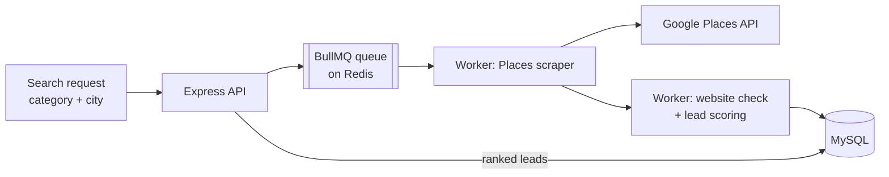

# 🎯 B2B Lead Generation Engine

[← Back to profile](../README.md)

> Own product · **Role:** designer and developer (Node.js version and a Laravel port)

## The problem

Finding businesses that actually *need* a website or app is manual work: search maps, open each listing, check whether they have a site, check whether it's any good, copy details into a sheet. It doesn't scale.

## What I built

An engine that discovers local businesses, scores how likely they are to need web/app work, and queues them for outreach.

- **Discovery** — pulls businesses by category and location from the Google Places API
- **Scoring** — rules-based lead score; for example, *no website* = **+60**, *weak website* = **+40**
- **Queue** — every scrape and enrichment step runs as a background job, so large searches don't block the API and failed jobs retry
- **API** — Express endpoints to start searches and fetch ranked leads
- **Laravel port** — the same engine rebuilt in Laravel for PHP-hosted environments

## Architecture

## Engineering decisions

- **Queue-based from day one.** External API calls are slow and rate-limited; BullMQ workers give retries, concurrency control and progress tracking for free.
- **Explainable scoring.** A simple points model beats a black box here — anyone can see *why* a lead ranks high and tune the weights.
- **Vertical-first.** First vertical is businesses needing web/app development; the scoring rules are the only part that changes per vertical.
- **Two runtimes.** Built in Node.js for the async/queue workload, then ported to Laravel so it can run where only PHP hosting is available.

## Stack

`Node.js` · `Express` · `BullMQ` · `Redis` · `MySQL` · `Google Places API` · `Laravel`
