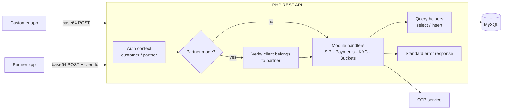

# 💰 FinTech Mutual-Fund Investment Platform — REST API

[← Back to profile](../README.md)

> Client project (India) · Code is private under NDA · **Role:** backend developer, API design & implementation

## The problem

A mutual-fund investment platform needed one backend serving two kinds of users:

- **Customers** investing directly, and
- **Partners (distributors)** who onboard, invest and manage portfolios *on behalf of* their clients.

Both modes needed to share the same business logic — SIPs, payments, KYC, portfolios — without duplicating endpoints, while keeping strict separation of who can act on whose data.

## What I built

| Module | Highlights |
|---|---|
| **Partner onboarding** | Registration written as a single DB transaction across five tables; partner list, edit and status toggle |
| **Dual-mode auth** | One auth context for every request; partner actions verified through the client's `referred_by_partner_id` so a partner can only touch their own clients |
| **SIP management** | Create/manage SIPs, plus a **two-step OTP flow to pause a SIP** (validate SIP + instalment → issue OTP → verify within a 15-minute window) |
| **Payments** | Payment verification for NEFT, e-Mandate and cheque, with OTP-confirmed payment flows |
| **Buckets & portfolios** | Curated fund "buckets" with add / list / detail endpoints and return calculations done at the API layer |
| **Fund finder, KYC & folios** | Fund search, KYC document endpoints, folio management |
| **Partner cart** | Partners assemble multi-fund orders for their clients |
| **Support tickets** | Ticketing system for customers and partners |

## Architecture

## Engineering decisions

- **One codebase, two modes.** Every endpoint accepts an optional `clientId`; when a partner calls it, ownership is checked before any read or write. No duplicated "partner version" of endpoints.
- **Consistent conventions.** Shared query helpers, a single auth context object and a standard error response keep dozens of endpoints predictable for the frontend team.
- **OTP for sensitive state changes.** Pausing a SIP or confirming a payment is a two-step request/verify flow with an expiry window — nothing money-related changes on a single call.
- **Documentation as a deliverable.** A Postman collection was maintained alongside the code for every endpoint, so frontend and QA never worked from guesses.
- **Deployment hygiene.** Tracked down recurring "code deployed but old behaviour still live" issues to PHP OPcache on the server.

## Stack

`PHP` · `MySQL` · `REST` · `OTP flows` · `Postman`
