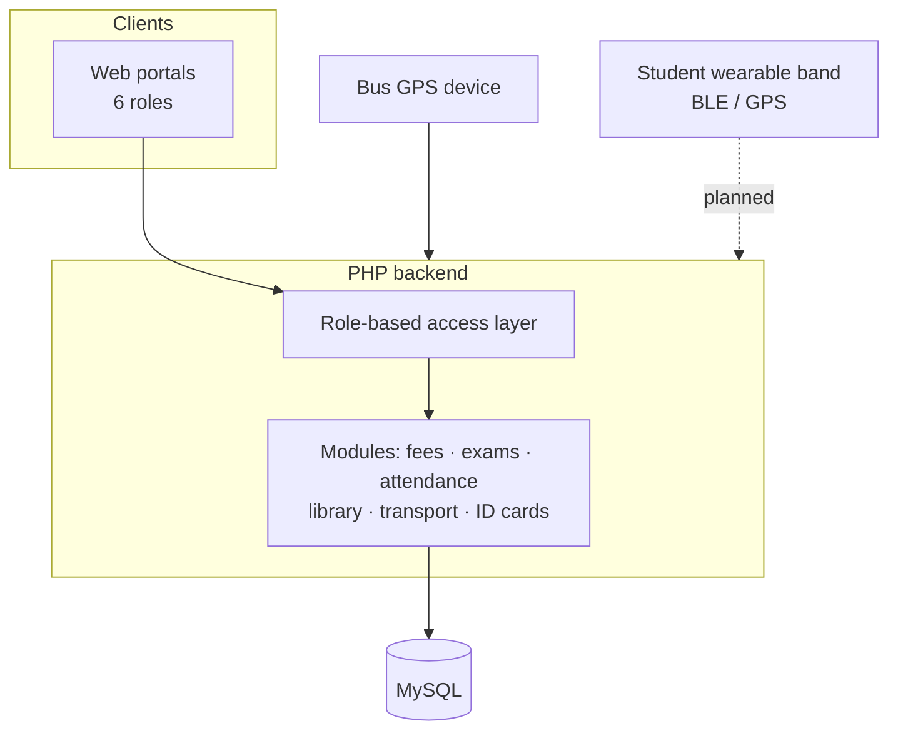

# 🏫 Scholaria — School ERP SaaS

[← Back to profile](../README.md)

> My own SaaS product · Live at [pulsenow.in/erp](https://pulsenow.in/erp) · **Role:** product owner, architect and developer

## The problem

Schools run fees, attendance, exams, library and transport on disconnected registers and spreadsheets. Parents have no live view of where the school bus is, and admin staff re-enter the same student data in several places.

## What I built

A multi-tenant-ready school ERP with **six role-based portals** and **15+ modules**.

| Role | Sees / does |
|---|---|
| **Super Admin** | School setup, users, permissions, global settings |
| **Principal** | School-wide dashboards, approvals, reports |
| **Teacher** | Attendance, marks entry, class management |
| **Student** | Timetable, results, library, fees status |
| **Parent** | Child's attendance, fees, results, live bus location |
| **Librarian** | Catalogue, issue / return, fines |

**Key modules:** fees · attendance · exams & results · library · transport with **live GPS tracking** · **ID card generator** · role-based access control · **IoT wearable-band integration**.

## Architecture

## Product & engineering decisions

- **Spec first.** Wrote a full role-based feature specification — every role × every module × every permission — before building, which kept 15+ modules consistent.
- **RBAC as a layer, not an afterthought.** Access rules live in one place, so adding a role or module doesn't mean touching every page.
- **Phased delivery.** Phase 1 shipped the core modules; Phase 2 is a UI overhaul based on real usage.
- **Hardware-backed business model.** Long-term plan pairs the ERP with a student wearable band (BLE + GPS) sold per student — turning a one-time sale into recurring SaaS revenue.
- **AI-assisted UI workflow.** Used AI design/build tools with a maintained prompt library to iterate on the frontend quickly, with the backend and data model hand-built.

## Stack

`PHP` · `MySQL` · `RBAC` · `GPS tracking` · `IoT (BLE / GPS)`
