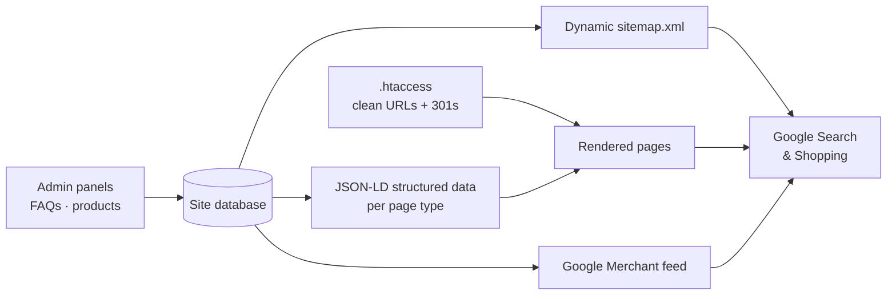

# 🔎 Technical SEO & E-commerce Engineering

[← Back to profile](../README.md)

> Client work for businesses in the **UAE** and **Canada** · Code is private · **Role:** developer — implementation of SEO infrastructure and storefront features

## The problem

Good-looking sites that search engines can't fully understand: no structured data, static or missing sitemaps, broken legacy URLs, and product catalogues that weren't eligible for Google Shopping.

## What I built

### UAE — technology services company (multi-office)

- **Schema.org structured data** across the site: `Organization`, `BreadcrumbList`, `Article`, `FAQPage`, `Service`, `SoftwareApplication` for a voice-bot product, and `LocalBusiness` / `ProfessionalService` for **each office** (Dubai, Abu Dhabi, Oman)
- **FAQ admin panel** with drag-to-reorder, feeding `FAQPage` schema automatically
- **Dynamic XML sitemap** generated from the database
- **301 redirect map** in `.htaccess` to preserve rankings from old URLs

### Canada — furniture retailer

- **SEO category landing pages** in PHP (bedroom, living, dining, sofas, sectionals, recliners and more)
- **Clean URL routing** with `.htaccess` — `category / sub-category / product-slug`
- **Google Merchant product feed** so the catalogue appears in Google Shopping
- **Star-rating badges**, product detail page, discount modal redesign, product image variant fix

### Other sites

- Dynamic sitemaps that **auto-detect table columns** so they keep working when the schema changes
- `AggregateRating` schema generated from real testimonial ratings in the database

## How it fits together

## Approach

- **Data-driven, not hard-coded.** Schema, sitemaps and feeds are generated from the database, so content editors never have to touch SEO markup.
- **Location-aware markup.** Each physical office gets its own `LocalBusiness` entity for local search.
- **Don't lose what you've earned.** Every URL change ships with a 301 map.

## Stack

`PHP` · `MySQL` · `Schema.org / JSON-LD` · `.htaccess` · `Google Merchant Center` · `JavaScript`
